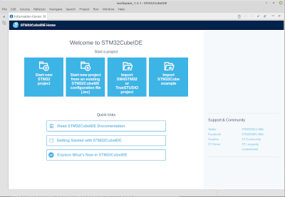

#### Table of contents

* [Overview](#overview)
* [Prerequisites](#prerequisites)
* [VirtualBox installation](#virtualboxInstallation)
* [Creation of the VM](#creationOfTheVm)
* [VM configuration](#vmConfiguration)
  * [Reference documents](#referenceDocuments)
  * [STM32CubeIDE installation](stm32cubeideInstallation)
  * [Sample application](#sampleApplication)

# Overview

This short tutorial describes a way to make a virtual machine configured for STM32 software development with STM32CubeIDE, and explains how to use it. The virtualization environment is VirtualBox, and the guest machine runs Linux Mint 20.1.

# Prerequisites

* hardware: a 64-bit computer with enough memory so that the VM can be granted 16 GB, with a few tens of GB available on the disk, and one free USB A port
* hardware (bis): a [Nucle-L476RG board](https://my.st.com/content/my_st_com/en/products/evaluation-tools/product-evaluation-tools/mcu-mpu-eval-tools/stm32-mcu-mpu-eval-tools/stm32-nucleo-boards/nucleo-l476rg.html) with an USB A / micro USB B cable - any similar NUCLEO board can be used
* developer: 
  * basic knowledge of Linux (knowing the most common commands...)
  * basic knowledge of VirtualBox (knowing how to create a virtual machine...)

# VirtualBox installation

[Download the VirtualBox binary package for your platform and install it](https://www.virtualbox.org/wiki/Downloads). Version at time of writing is 6.1.18.

Install the Extension Pack: it provides support for USB 2.0 and 3.0 devices.

# Creation of the VM

[Download Linux Mint 20.1, MATE edition](https://linuxmint.com/download.php).

[Verify the integrity of the downloaded file](https://linuxmint.com/verify.php).

Start VirtualBox, and create a new virtual machine, using the Linux Mint ISO file previously downloaded. Set memory size to 16 GB and file size to 30 GB.

Wait for Linux desktop to be displayed.

If your keyboard layout is not QWERTY, click on the main-menu icon (the small icon displaying Linux Mint logo, in the lower left-hand corner), select **Control Center**, click on **Keyboard** icon, select **Layouts** tab, add the layout for your keyboard, and remove the existing **English (US)** layout. Close the Control Center windows.

Double click on the **Install Linux Mint** icon. Following information or selections can be provided, when required for:
* language: English
* keyboard layout: the one for your keyboard
* install multimedia codecs
* erase disk and install Linux Mint
* name: Developer
* computer's name: ESP32LM
* username: developer
* password: choose one

At the end of the installation, restart. When you get the message **Please remove the installation medium, then press ENTER:**, click on Enter key.

Log in as *developer* user. Close the **Welcome to Linux Mint** window.

In the VirtualBox menu, select **Devices > Insert Guest Additions CD image...**. Double-click on the CD icon that appeared on the desktop. In the file explorer window, right-click on the **VBoxLinuxAdditions.run** file and select **Run as Administrator**. The password you are then asked for is the one you chose at installation time.

Once the guest additions are installed, you can right-click on the CD icon and select **Eject**.

Click on the system report icon, in the lower right-hand corner: . In the **System Reports** window that appears, select **System reports > Install language packs**, click on **Install the Language Packs** button, and accept the installation. The requested password is the one you chose at installation time.

For the system restore utility, click on **Ignore this report**. Close the window.

Click on the update manager icon, in the lower right-hand corner: . In the welcome screen of the **Update Manager** window that appears, click on **OK** button. Click on the **No** button of the **Do you want to switch to a local mirror?** banner (you'll be able to choose one later on). If you are told that a new version of the update manager is available, click on **Apply the Update** button. Again, the requested password is the one you chose above (I won't say it anymore :-) ). Click on **Install Updates** button, and accept additional changes.

Reboot, if you are required to: main menu and **Quit > Restart**.

You can resize the VirtualBox window: the Linux Mint desktop will resize accordingly.

# VM configuration

## Reference documents

* [STM32CubeIDE basics MOOC](https://www.st.com/content/st_com/en/support/learning/stm32-education/stm32-moocs/STM32CubeIDE_basics_MOOC.html)

## STM32CubeIDE installation

* [download STM32CubeIDE Debian Linux Installer 1.5.1](https://my.st.com/content/my_st_com/en/products/development-tools/software-development-tools/stm32-software-development-tools/stm32-ides/stm32cubeide.html). You will have to create an account
* unzip the file
* install the application according to the [Installation Guide](https://my.st.com/resource/en/user_manual/dm00603964-stm32cubeide-installation-guide-stmicroelectronics.pdf)
  * install Segger J-Link udev rules

## Sample application

* start STM32CubeIDE (from main menu and then **All applications > Programming**
* keep the default workspace and click on the **Launch** button
* the welcome window is displayed:

